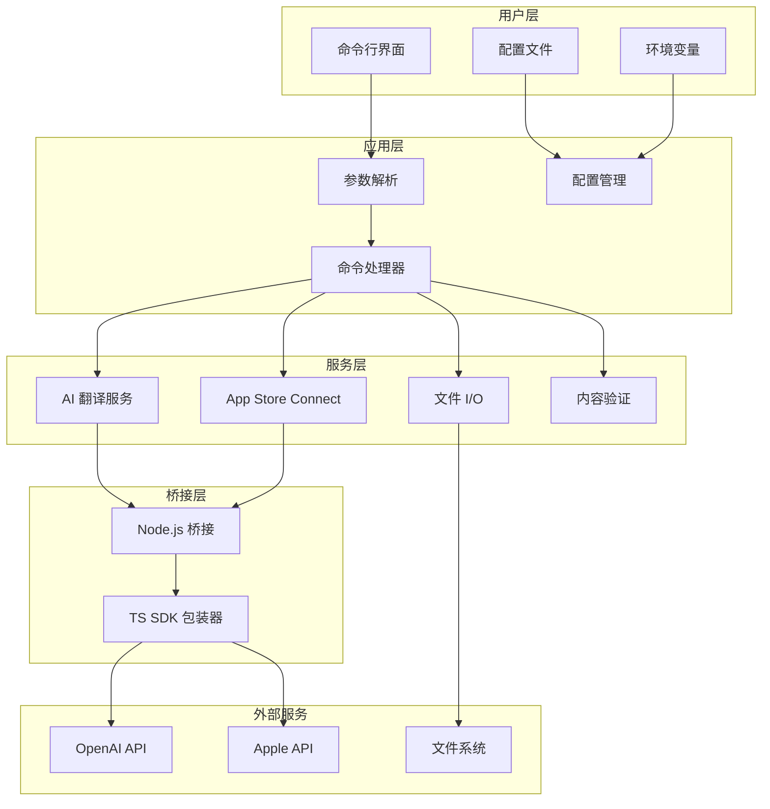
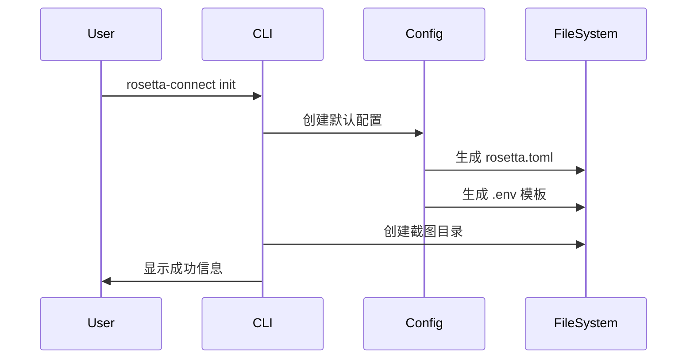
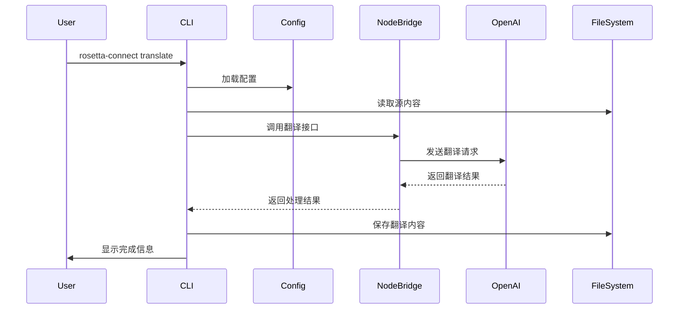
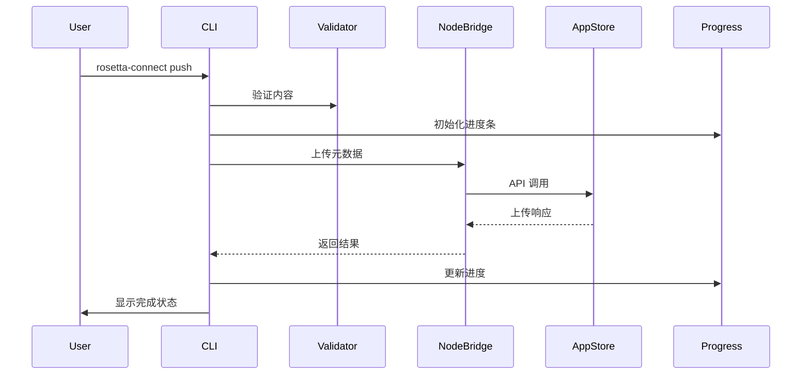

# 🏗️ 技术架构说明

本文档深入介绍 Rosetta Connect 的技术架构、设计原理和实现细节，帮助开发者理解工具的内部工作机制。

## 🎯 设计目标

### 核心理念
- **🚀 性能优先**: 使用 Rust 构建，确保启动快速、运行高效
- **🔧 零配置**: 开箱即用，最小化用户配置负担
- **🌍 跨平台**: 支持 macOS、Linux、Windows 三大平台
- **🔌 可扩展**: 模块化设计，便于添加新功能
- **🛡️ 类型安全**: 充分利用 Rust 的类型系统避免运行时错误

### 技术选型原则
1. **Rust 核心**: 利用 Rust 的安全性和性能优势
2. **Node.js 生态**: 复用成熟的 App Store Connect SDK
3. **异步优先**: 全面使用异步 I/O 提升响应速度
4. **CLI 友好**: 优秀的命令行用户体验

## 🏛️ 整体架构



## 🗂️ 模块结构

### Workspace 组织
```
rosetta-connect/
├── crates/
│   ├── rc-cli/          # 主要 CLI 应用
│   │   ├── src/
│   │   │   ├── main.rs          # 入口点
│   │   │   ├── config.rs        # 配置管理
│   │   │   └── commands/        # 命令实现
│   │   │       ├── mod.rs
│   │   │       ├── init.rs
│   │   │       ├── pull.rs
│   │   │       ├── push.rs
│   │   │       ├── translate.rs
│   │   │       └── ...
│   │   └── Cargo.toml
│   └── rc-node/         # Node.js 桥接层
│       ├── src/
│       │   └── lib.rs           # 桥接函数
│       └── Cargo.toml
├── js/                  # TypeScript 包装器
│   ├── asc.ts                   # App Store Connect SDK
│   ├── package.json
│   └── tsconfig.json
└── Cargo.toml          # Workspace 配置
```

## 🔧 核心组件详解

### 1. CLI 框架 (`rc-cli`)

#### 命令行解析
使用 [clap](https://github.com/clap-rs/clap) v4 进行参数解析:

```rust
#[derive(Parser)]
#[command(name = "rosetta-connect")]
#[command(about = "A CLI tool for App Store Connect localization")]
struct Cli {
    #[command(subcommand)]
    command: Commands,
    
    #[arg(short, long, default_value = "rosetta.toml")]
    config: PathBuf,
    
    #[arg(short, long)]
    verbose: bool,
}
```

**设计亮点:**
- 声明式参数定义，类型安全
- 自动生成帮助信息
- 支持子命令和全局选项
- 内置参数验证

#### 配置管理
```rust
#[derive(Debug, Serialize, Deserialize)]
pub struct Config {
    pub app: AppConfig,
    pub assets: Option<AssetsConfig>,
    pub ai: Option<AiConfig>,
}
```

**特性:**
- TOML 格式，人类友好
- 支持可选配置节
- 环境变量覆盖机制
- 默认值系统

#### 异步命令处理
```rust
#[tokio::main]
async fn main() -> Result<()> {
    match cli.command {
        Commands::Pull => commands::pull::run(&cli.config).await,
        Commands::Translate { locales, model } => {
            commands::translate::run(locales, model, &cli.config).await
        },
        // ...
    }
}
```

**优势:**
- 全异步执行，不阻塞用户界面
- 并发处理多个任务
- 优雅的错误处理机制

### 2. Node.js 桥接层 (`rc-node`)

#### 当前实现 (MVP 阶段)
```rust
pub async fn asc_upload(meta: Value) -> anyhow::Result<Value> {
    // 模拟 API 调用
    println!("Node bridge: uploading metadata: {}", meta);
    tokio::time::sleep(Duration::from_millis(100)).await;
    
    Ok(serde_json::json!({
        "success": true,
        "uploaded_files": 5,
        "message": "Upload completed successfully"
    }))
}
```

#### 计划中的实现 (Phase 2)
```rust
// 使用 edon 或类似的 Node.js 嵌入库
#[node(script = include_str!("../../js/asc.ts"))]
extern "C" {
    #[napi]
    async fn asc_upload(meta: serde_json::Value) -> napi::Result<serde_json::Value>;
}
```

**技术方案对比:**

| 方案 | 优势 | 劣势 | 状态 |
|------|------|------|------|
| **edon** | 内嵌 Node.js，零依赖 | 复杂度高，调试困难 | 🔬 研究中 |
| **libnode** | 官方支持，稳定性好 | 外部依赖，体积较大 | 📋 计划中 |
| **JSON-RPC** | 简单清晰，易调试 | 需要启动子进程 | 🤔 备选 |
| **模拟 API** | 开发快速，无依赖 | 功能受限 | ✅ 当前 |

### 3. TypeScript SDK 包装器

#### App Store Connect 集成
```typescript
class AppStoreConnectWrapper {
    private api: AppStoreConnectApi;
    
    constructor() {
        const { ISSUER_ID, KEY_ID, PRIVATE_KEY_PATH } = process.env;
        const privateKey = fs.readFileSync(PRIVATE_KEY_PATH, 'utf8');
        
        this.api = new AppStoreConnectApi({
            issuerId: ISSUER_ID,
            keyId: KEY_ID,
            privateKey,
        });
    }
    
    async uploadMetadata(metadata: AppMetadata): Promise<UploadResult> {
        // 实际 API 调用逻辑
    }
}
```

#### OpenAI 集成 (计划中)
```typescript
class OpenAITranslator {
    async translateContent(
        content: string,
        targetLocale: string,
        context: TranslationContext
    ): Promise<TranslatedContent> {
        const response = await openai.chat.completions.create({
            model: "gpt-4o-mini",
            messages: [
                {
                    role: "system",
                    content: this.buildSystemPrompt(targetLocale, context)
                },
                {
                    role: "user", 
                    content: this.buildUserPrompt(content)
                }
            ]
        });
        
        return this.parseResponse(response);
    }
}
```

## 🔄 数据流程

### 1. 初始化流程


### 2. 翻译流程


### 3. 推送流程


## 🛠️ 关键技术实现

### 1. 异步架构设计

#### Tokio 运行时
```rust
#[tokio::main]
async fn main() -> Result<()> {
    // 所有操作都在异步上下文中
    let tasks = vec![
        tokio::spawn(upload_metadata()),
        tokio::spawn(upload_screenshots()),
        tokio::spawn(validate_content()),
    ];
    
    // 并发执行，等待所有任务完成
    try_join_all(tasks).await?;
}
```

#### 进度显示
```rust
use indicatif::{ProgressBar, ProgressStyle};

let pb = ProgressBar::new(100);
pb.set_style(ProgressStyle::default_bar()
    .template("{spinner:.green} [{bar:40.cyan/blue}] {pos}/{len} {msg}")
    .unwrap());

for i in 0..100 {
    pb.set_position(i);
    tokio::time::sleep(Duration::from_millis(50)).await;
}
```

### 2. 错误处理策略

#### 错误类型设计
```rust
use anyhow::{Context, Result};
use thiserror::Error;

#[derive(Error, Debug)]
pub enum RosettaError {
    #[error("Configuration error: {0}")]
    Config(String),
    
    #[error("API error: {0}")]
    Api(String),
    
    #[error("Translation error: {0}")]
    Translation(String),
}
```

#### 错误传播
```rust
pub async fn pull_content(config: &Config) -> Result<()> {
    let api_result = call_api(&config.app.bundle_id).await
        .with_context(|| "Failed to connect to App Store Connect")?;
        
    let content = parse_response(api_result)
        .with_context(|| "Failed to parse API response")?;
        
    save_to_file(&content)
        .with_context(|| "Failed to save content to file")?;
        
    Ok(())
}
```

### 3. 配置系统架构

#### 配置优先级
1. 命令行参数 (最高)
2. 环境变量
3. 配置文件
4. 默认值 (最低)

#### 实现方式
```rust
impl Config {
    pub fn load_with_overrides(
        config_path: &Path,
        cli_args: &Cli
    ) -> Result<Self> {
        let mut config = Self::load(config_path)?;
        
        // 环境变量覆盖
        if let Ok(model) = env::var("ROSETTA_AI_MODEL") {
            config.ai.get_or_insert_with(Default::default).model = model;
        }
        
        // 命令行参数覆盖
        if let Some(verbose) = cli_args.verbose {
            config.verbose = verbose;
        }
        
        Ok(config)
    }
}
```

### 4. 类型安全的序列化

#### 强类型配置
```rust
#[derive(Debug, Serialize, Deserialize)]
pub struct AppConfig {
    pub bundle_id: String,
    #[serde(default = "default_locale")]
    pub default_locale: String,
    pub target_locales: Vec<String>,
}

fn default_locale() -> String {
    "en-US".to_string()
}
```

#### JSON Schema 验证
```rust
use schemars::{JsonSchema, schema_for};

#[derive(JsonSchema, Serialize, Deserialize)]
pub struct TranslationRequest {
    pub content: String,
    pub target_locale: String,
    pub context: TranslationContext,
}

// 编译时生成 JSON Schema
let schema = schema_for!(TranslationRequest);
```

## 🚀 性能优化策略

### 1. 编译时优化
```toml
[profile.release]
lto = true              # 链接时优化
codegen-units = 1       # 单元代码生成
panic = "abort"         # 减少二进制大小
opt-level = "z"         # 优化大小
```

### 2. 运行时优化

#### 内存池
```rust
use bytes::{Bytes, BytesMut};

struct ContentBuffer {
    pool: Vec<BytesMut>,
}

impl ContentBuffer {
    fn get_buffer(&mut self) -> BytesMut {
        self.pool.pop().unwrap_or_else(|| BytesMut::with_capacity(4096))
    }
    
    fn return_buffer(&mut self, buf: BytesMut) {
        if buf.capacity() <= 8192 {
            self.pool.push(buf.clear());
        }
    }
}
```

#### 并发控制
```rust
use tokio::sync::Semaphore;

const MAX_CONCURRENT_REQUESTS: usize = 10;
let semaphore = Arc::new(Semaphore::new(MAX_CONCURRENT_REQUESTS));

// 限制并发数量
let _permit = semaphore.acquire().await?;
let result = make_api_request().await?;
```

### 3. I/O 优化

#### 异步文件操作
```rust
use tokio::fs;
use tokio::io::{AsyncReadExt, AsyncWriteExt};

async fn save_content_async(path: &Path, content: &[u8]) -> Result<()> {
    let mut file = fs::File::create(path).await?;
    file.write_all(content).await?;
    file.flush().await?;
    Ok(())
}
```

#### 流式处理
```rust
use tokio_stream::StreamExt;

async fn process_large_file(path: &Path) -> Result<()> {
    let file = fs::File::open(path).await?;
    let mut lines = io::BufReader::new(file).lines();
    
    while let Some(line) = lines.next_line().await? {
        // 流式处理每一行
        process_line(&line).await?;
    }
    
    Ok(())
}
```

## 🔐 安全考虑

### 1. 凭据管理
- 私钥文件权限检查 (600)
- 环境变量隔离
- 内存中凭据及时清理

### 2. API 调用安全
- TLS 证书验证
- 请求签名验证
- 重试机制防止滥用

### 3. 文件系统安全
- 路径遍历攻击防护
- 临时文件安全删除
- 权限最小化原则

## 📊 监控和调试

### 1. 日志系统
```rust
use tracing::{info, warn, error, debug};
use tracing_subscriber;

// 初始化日志
tracing_subscriber::fmt()
    .with_env_filter("rosetta_connect=debug")
    .init();

// 在代码中使用
info!(bundle_id = %config.app.bundle_id, "Starting translation");
debug!("API response: {}", serde_json::to_string(&response)?);
```

### 2. 性能指标
```rust
use std::time::Instant;

let start = Instant::now();
let result = expensive_operation().await?;
let duration = start.elapsed();

info!("Operation completed in {:?}", duration);
```

### 3. 错误报告
```rust
use color_eyre::eyre::{Result, WrapErr};

fn setup_error_reporting() -> Result<()> {
    color_eyre::install()?;
    Ok(())
}
```

## 🔮 未来架构演进

### Phase 2: 生产就绪
- [ ] 真实 Node.js 运行时集成
- [ ] OpenAI API 集成
- [ ] 完整的 App Store Connect API
- [ ] 文件 I/O 和本地缓存

### Phase 3: 高级功能
- [ ] 插件系统架构
- [ ] WebAssembly 支持
- [ ] 分布式翻译处理
- [ ] 实时协作功能

### Phase 4: 企业级
- [ ] 微服务架构
- [ ] Kubernetes 部署
- [ ] 监控和告警系统
- [ ] API 网关集成

---

<p align="center">
  🏗️ <strong>这个架构文档会随着项目发展持续更新</strong>
</p>

<p align="center">
  对技术实现有疑问？欢迎查看 <a href="./troubleshooting.md">故障排除指南</a> 或 <a href="https://github.com/yourusername/rosetta-connect/discussions">参与讨论</a>
</p>